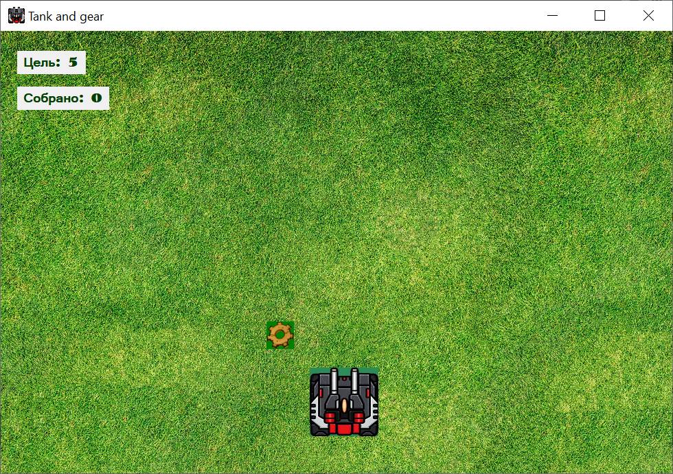
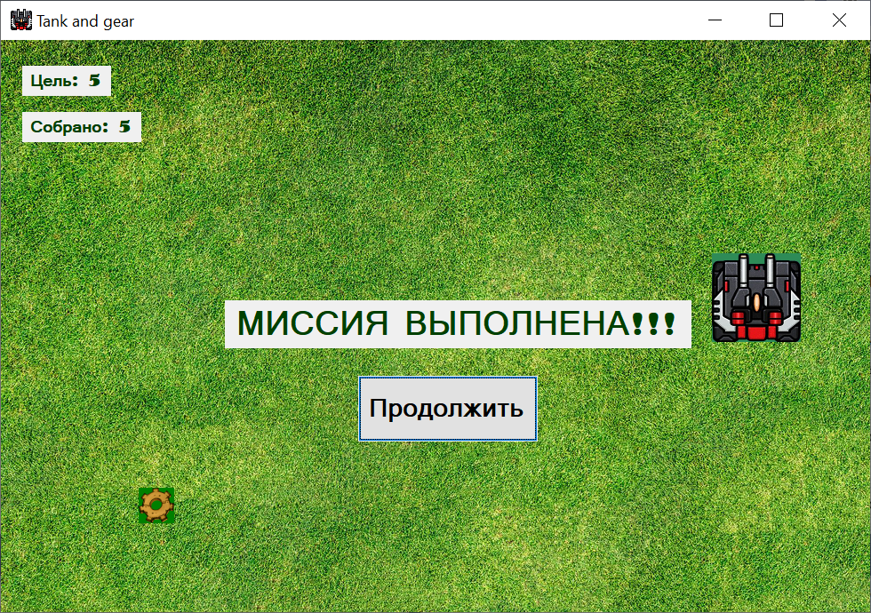

# TankAndGear

C# игра сделанная с помощью Windows Forms.

## Описание игры

В игре, управляя танком необходимо собирать разбросанные по полю шестерёнки. Когда накапливается нужно количество отображается победный экран, с возможностью запуска следующей миссии. Целью каждой последующей миссии будет большее число шестерёнок

## Как скачать и запустить

Скачайте папку `Build` целиком. В папке есть файл `TankAndGear.exe`, с помощью которого запускается игра.

> У вас должна быть установлена платформа `.Net`. 
> Ссылка на скачивание платформы: [https://dotnet.microsoft.com/en-us/download/dotnet-framework](https://dotnet.microsoft.com/en-us/download/dotnet-framework)

## Скриншоты

